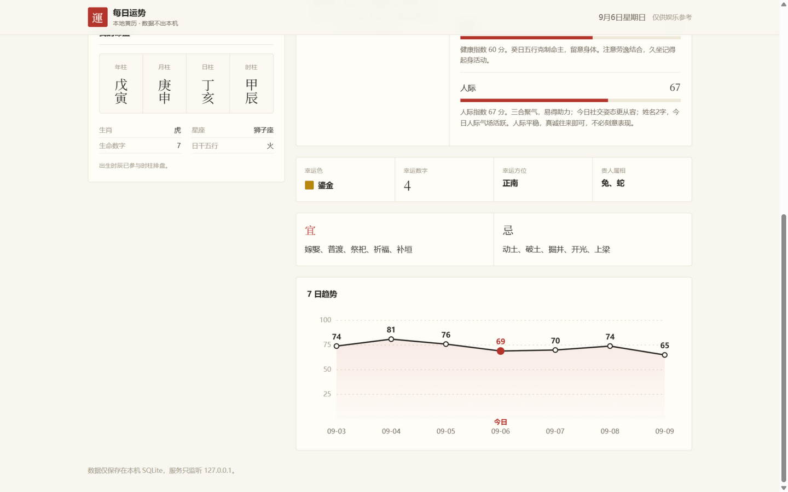

<div align="center">

# ✨ 每日运势 Daily Luck

**本地优先的个人每日运势仪表盘** —— 八字排盘 · 分类指数 · 黄历宜忌 · 7 日趋势

你的姓名与生辰只保存在你自己的电脑里，加密入库、离线可用，不上传任何服务器。

[](https://github.com/jying3040-cmd/Daily-luck/actions/workflows/ci.yml)
[](https://nodejs.org/)
[](https://vuejs.org/)
[](LICENSE)

[English](README.en.md) | 简体中文


</div>

---

## 为什么是「每日运势」？

市面上大多数运势应用要么是网页小广告，要么要求你把生辰八字上传到陌生服务器。这个项目反其道而行：

- 🔒 **数据 100% 本地**：档案存入本机 SQLite，姓名与手机尾号用 AES-256-GCM 加密后才落盘，服务只监听 `127.0.0.1`，没有账号、没有上报、没有追踪。
- 🔁 **结果稳定可复现**：相同日期 + 相同档案 → 相同结果，并有测试锁定行为，不是每次刷新都变的随机数。
- 🧧 **认真对待传统历法**：基于 `lunar-typescript` 计算真实的干支历、黄历宜忌与生肖冲煞，而不是编造话术。
- 🧑‍💻 **工程完整**：TypeScript 全栈、API 集成测试、CI、Dependabot、issue 模板一应俱全，适合作为全栈参考项目阅读。

## 界面预览



## 功能

- 📋 档案管理：姓名、出生日期、出生时辰、手机尾号、血型与性别，本地加密保存
- 🀄 命盘排盘：八字四柱、星座、生肖、生命数字与日干五行
- 📊 五项指数：事业、财运、感情、健康、人际，附综合分与解读
- 📜 黄历宜忌：幸运色、幸运数字、幸运方位、贵人属相与冲煞生肖
- 📈 7 日趋势：以今天为中心的前后三天运势曲线
- 💾 SQLite 缓存：报告按日缓存，重复访问零计算

## 分数是怎么生成的？

Daily Luck 是确定性的娱乐产品，不是预测模型。相同档案与日期永远得到相同结果；界面上的整数分用于呈现相对趋势，不代表统计概率或现实事件发生率。

| 数据来源 | 在产品中的作用 | 性质 |
| --- | --- | --- |
| `lunar-typescript` | 农历、八字、生肖、宜忌、冲煞和方位 | 历法数据与传统规则 |
| 出生日期与时辰 | 四柱、星座、生肖、生命数字与五行关系 | 传统/流行文化映射 |
| 血型、手机尾号、姓名长度 | 对分类分数施加小幅加成 | 产品自定义娱乐规则 |
| 档案与日期的哈希 | 生成稳定的基础分和少量变化 | 确定性伪随机，不是随机预测 |

五项分类先由稳定的基础分生成，再叠加上述规则，最后限制到固定区间并平均得到综合分。代码实现集中在 [`server/src/fortune.ts`](server/src/fortune.ts)，可以完整审阅、修改和测试。

因此请把 `69` 或 `74` 理解为同一套娱乐规则下的相对高低，而不是 69% 或 74% 的"准确率"。

## 快速开始

### 环境要求

- Node.js `22.12.0` 或更高版本
- npm `10` 或更高版本

### 方式一：Windows 一键启动

双击 [`start.bat`](start.bat)，脚本会自动安装依赖、构建并启动应用。

### 方式二：npm

```bash
# 开发模式（前端 http://localhost:5173，API http://127.0.0.1:3000）
npm install
npm run dev

# 生产模式（单端口 http://127.0.0.1:3000，由 Fastify 同时托管前端与 API）
npm install
npm run build
npm start
```

开发模式下 Vite 会将 `/api` 请求代理到后端，按 `Ctrl+C` 可同时停止两个进程。

### 方式三：Docker

```bash
docker build -t daily-luck .
docker run --rm -p 3000:3000 -v daily-luck-data:/app/data daily-luck
```

打开 <http://127.0.0.1:3000> 即可使用，档案数据持久化在 `daily-luck-data` 卷中。

## 可用命令

| 命令 | 用途 |
| --- | --- |
| `npm run dev` | 同时启动前后端开发服务 |
| `npm run test` | 运行服务端 API 与数据缓存测试 |
| `npm run build` | 类型检查并构建前后端 |
| `npm run verify` | 检查历法、SQLite 与 Fastify 运行环境 |
| `npm run check` | 依次运行测试、构建和环境自检 |
| `npm start` | 启动构建后的单端口生产服务 |

## 技术栈

| 层 | 技术 |
| --- | --- |
| 前端 | Vue 3、TypeScript、Vite、Tailwind CSS 4、Lucide Icons |
| 服务端 | Node.js、Fastify、`node:sqlite` |
| 历法 | `lunar-typescript` |
| 测试 | Node.js Test Runner、Fastify `inject()` |

## 项目结构

```text
.
├── .github/                 # CI、Dependabot 与协作模板
├── docs/screenshots/        # README 截图
├── frontend/                # Vue 前端
│   └── src/
├── server/                  # Fastify 服务端
│   └── src/
│       ├── app.ts           # 应用工厂、数据库与 API
│       ├── app.test.ts      # API 集成测试
│       ├── fortune.ts       # 排盘与运势规则
│       └── crypto.ts        # 本地字段加密
├── scripts/dev.mjs          # 跨平台开发进程启动器
├── start.bat                # Windows 一键启动
└── package.json             # npm workspaces 与根命令
```

## API

| 方法 | 路径 | 说明 |
| --- | --- | --- |
| `GET` | `/health` | 服务健康检查 |
| `GET` | `/api/today` | 历法引擎探测 |
| `GET` | `/api/profile` | 读取档案与命盘 |
| `PUT` | `/api/profile` | 校验并保存档案 |
| `GET` | `/api/reports?start=YYYY-MM-DD&end=YYYY-MM-DD` | 获取最多 366 天报告 |

## 数据与隐私

- 数据写入项目根目录的 `data/fortune.db`。
- 姓名与手机尾号使用 AES-256-GCM 加密后入库。
- 首次运行时会在 `data/secret.key` 生成本地密钥。
- `data/`、构建产物、依赖和环境文件均已加入 `.gitignore`。
- 服务默认只监听 `127.0.0.1`，且不开放跨域 API 访问。
- 请同时备份数据库与密钥；丢失 `secret.key` 后，已加密字段无法恢复。

> ⚠️ 不要把 `data/fortune.db`、`data/secret.key` 或真实个人资料提交到 GitHub。

## 参与贡献

欢迎提交 Issue 和 PR！提交改动前请阅读 [CONTRIBUTING.md](CONTRIBUTING.md)，并至少运行：

```bash
npm run check
npm audit --audit-level=high
```

安全问题请按 [SECURITY.md](SECURITY.md) 中的方式私下报告。

## 许可

本项目采用 [MIT License](LICENSE) 开源。

---

> **免责声明**：运势与命理内容属于传统文化与娱乐范畴，仅供娱乐参考，不构成医疗、财务、法律或其他现实决策建议。
